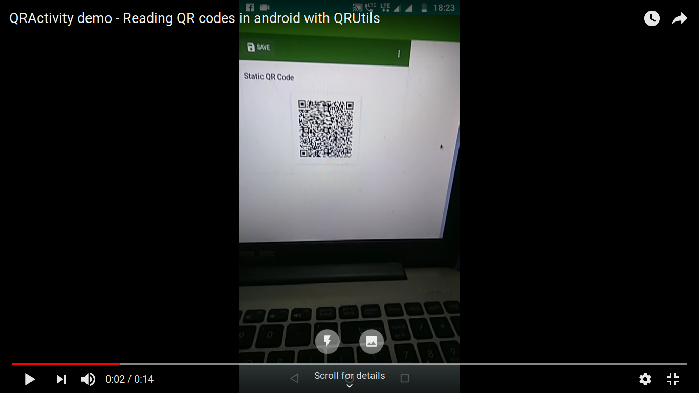

# QRActivity

[  ](https://bintray.com/chtgupta/QRUtils/chtgupta.qrutils.qractivity/_latestVersion)


Say hi to QRActivity! A customizable, pre-built activity ready to launch and read QR codes with a few lines of code. Equipped with essential features like flashlight toggle, an image picker to get and read QR codes from image files. Enjoy the first ever ready-made QR mechanism for Android.

* **Stuffed w/ features:** Image picker, flashlight toggle, autofocus and much more
* **Fast:** You can expect it to lauch, read the QR and return the result within a second
* **Customizable:** Restrict image picker usage, autofocus interval, toggle fullscreen and more

## Demo Video
Click on the thumbnail below to watch demo video

<a href="https://youtu.be/lKSWgqqBhls" target="_blank"></a>

## Installation

### Gradle

In your `app/build.gradle` file add a dependency on one of the QRUtils libraries.

```groovy

  dependencies {

      implementation 'chtgupta.qrutils:qractivity:0.1.0'
  }

```

### Maven

Step 1. Add the JitPack repository to your build file

Add the dependency

```xml
  <dependency>
     <groupId>chtgupta.qrutils</groupId>
     <artifactId>qractivity</artifactId>
     <version>0.1.0</version>
     <type>pom</type>
  </dependency>
```

## Usage

#### Step I: Start the QRActivity for result with desired params

```java

private final int QR_SCAN_REQUEST_CODE = 123;	// declared globally

...

startActivityForResult(
                        new QRScanner(getBaseContext())         // required
                                .setFullScreen(false)           // optional
                                .setAutoFocusInterval(2000)     // optional
                                .setFocusOnTouchEnabled(true)   // optional
                                .setImagePickerEnabled(true)    // optional
                                .build(), QR_SCAN_REQUEST_CODE  // required
                );

```

#### Step II: Get the result returned by the QRActivity

```java

@Override
    protected void onActivityResult(int requestCode, int resultCode, @Nullable Intent data) {

        if (requestCode == QR_SCAN_REQUEST_CODE) {

            if (resultCode == Activity.RESULT_OK) {

                String qrData = data.getStringExtra("qrData");    // getting scanned QR data
                Toast.makeText(getBaseContext(), qrData, Toast.LENGTH_LONG).show();

            } else if (resultCode == RESULT_CANCELED) {

                String error = data.getStringExtra("error");      // getting the error message (in case one occurs)
                Toast.makeText(getBaseContext(), error, Toast.LENGTH_LONG).show();
            }
        }
    }
```

## Methods and functions

### Building

```java
setImagePickerEnabled(boolean imagePickerEnabled)	// enables/disables the use of image picker for reading QRs from image files
setFullScreen(boolean fullScreen)			// hides the status bar in QRActivity if true
setAutoFocusInterval(long interval)			// sets the auto focus interval in QR scanner
setFocusOnTouchEnabled(boolean focusOnTouch)		// decides if QR scanner should focus on tap (may not work on all devices)
build()							// builds the QR scanner and returns as an Intent (required)
```

### Getting the result

```java
String qrData = data.getStringExtra("qrData");    	// getting scanned QR data
String error = data.getStringExtra("error");      	// getting the error message (in case one occurs)
```

## Release History

* 0.1.0
	* Initial release

## Meta

Chahat Gupta – [@chtgupta](https://chtgupta.github.io) – admin@speakapp.me

Distributed under the APACHE 2.0 license. See ``LICENSE`` for more information.

[https://github.com/chtgupta/QRUtils-Android/](https://github.com/chtgupta/QRUtils-Android/)

## Contributing

1. **Fork** it
2. **Clone** the project to your own machine
3. **Commit** changes to your own branch
4. **Push** your work back up to your fork
5. Submit a **Pull request** so that I can review changes

## Support

* Liked my work? **Star** it to show support!
* Used it in your app? Let me know and I'll include your app name, logo and link in this repository.
* Want to take this to another level? Read ``CONTRIBUTING`` again!
