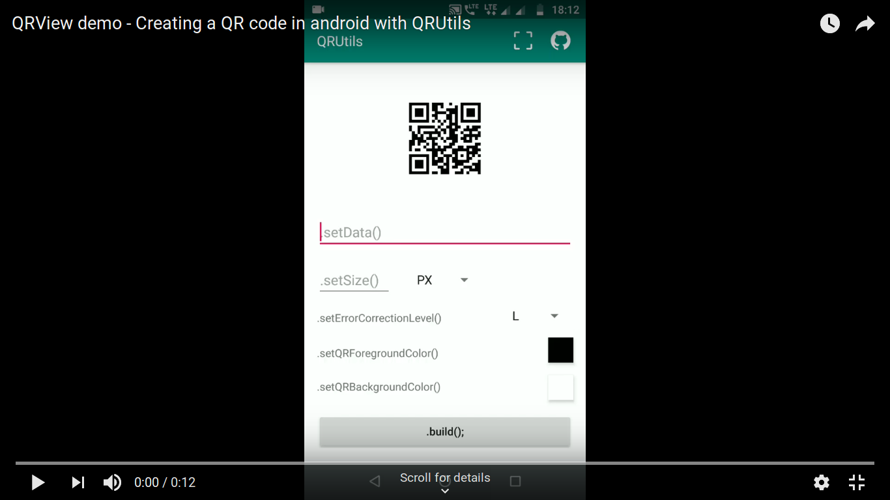

# QRView

[  ](https://bintray.com/chtgupta/QRUtils/chtgupta.qrutils.qrview/_latestVersion)


Say hi to QRView! A custom View that draws QR codes on the screen easily and efficiently.It  is the first ever library that deals with drawing QR codes on the layout.

* **Efficient:** Creates a QR code in just 3 lines of code
* **Flexible:** Can generate QR codes directly from XML attributes
* **Customizable:** Can play around with colours, error correction levels and more

## Demo Video

<a href="https://youtu.be/VGcbVXD85SM" target="_blank"></a>

## Installation

### Gradle

In your `app/build.gradle` file add a dependency on one of the QRUtils libraries.

```groovy

  dependencies {

      implementation 'chtgupta.qrutils:qrview:0.1.0'
  }

```

### Maven

Step 1. Add the JitPack repository to your build file

Add the dependency

```xml
  <dependency>
     <groupId>chtgupta.qrutils</groupId>
     <artifactId>qrview</artifactId>
     <version>0.1.0</version>
     <type>pom</type>
  </dependency>
```

## Usage

#### Case I: Creating QR directly from XML

```xml
<chtgupta.qrutils.qrview.QRView
    android:id="@+id/qrView"
    android:layout_width="wrap_content"
    android:layout_height="wrap_content"                        
    app:QR_data="https://chtgupta.github.io"
				
    // optional attributes
				
    app:QR_size="96dp"
    app:QR_errorCorrectionLevel="H"
    app:QR_foregroundColor="@android:color/black"
    app:QR_backgroundColor="@android:color/white"/>
```

#### Case II: Creating QR in the Activity

```java

  QRView qrView = findViewById(R.id.qrView);

        qrView.setData("https://chtgupta.github.io")			// required
                .setSize(120, QRParams.DP)				// optional
                .setErrorCorrectionLevel(ErrorCorrection.H)		// optional
                .setQRForegroundColor(Color.BLACK)			// optional
                .setQRBackgroundColor(Color.WHITE)			// optional
                .addListener(new QRViewListener() {			// optional
                    @Override
                    public void onQRInitiated() {
                        // fired when QR generation starts
                    }

                    @Override
                    public void onQRGenerating() {
                        // fired when QR is generating
                    }

                    @Override
                    public void onQRGenerated(Bitmap qrBitmap) {
                        // fired when QR is generated
                    }

                    @Override
                    public void onError() {
                        // fired if an error is encountered while generating QR
                    }
                })
                .build();  // required: always call build() after adding all methods and listener
```

## Attributes and methods

### XML

```xml                      
app:QR_data				<!-- sets the data in QR (required) -->
app:QR_size				<!-- sets the dimensions of QR -->
app:QR_errorCorrectionLevel		<!-- sets the error correction level in QR -->
app:QR_foregroundColor			<!-- sets the foreground color of QR -->
app:QR_backgroundColor			<!-- sets the background color of QR -->
```

### Java

```java
setData(String data)					// sets the data in QR (required)
setSize(int size)					// sets the dimensions of QR in px
setSize(int size, QRParams param)			// sets the dimensions of QR in px or dp
setErrorCorrectionLevel(ErrorCorrection level)		// sets the error correction level in QR
setQRForegroundColor(int color)				// sets the foreground color of QR
setQRBackgroundColor(int color)				// sets the background color of QR
addListener(QRViewListener listener)			// sets a listener to monitor progress of QR generation
build()							// builds/rebuilds the QR with provided params (required)
```

## Release History

* 0.1.0
	* Initial release

## Meta

Chahat Gupta – [@chtgupta](https://chtgupta.github.io) – admin@speakapp.me

Distributed under the APACHE 2.0 license. See ``LICENSE`` for more information.

[https://github.com/chtgupta/QRUtils-Android/](https://github.com/chtgupta/QRUtils-Android/)

## Contributing

1. **Fork** it
2. **Clone** the project to your own machine
3. **Commit** changes to your own branch
4. **Push** your work back up to your fork
5. Submit a **Pull request** so that I can review changes

## Support

* Liked my work? **Star** it to show support!
* Used it in your app? Let me know and I'll include your app name, logo and link in this repository.
* Want to take this to another level? Read ``CONTRIBUTING`` again!
